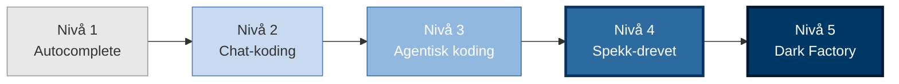
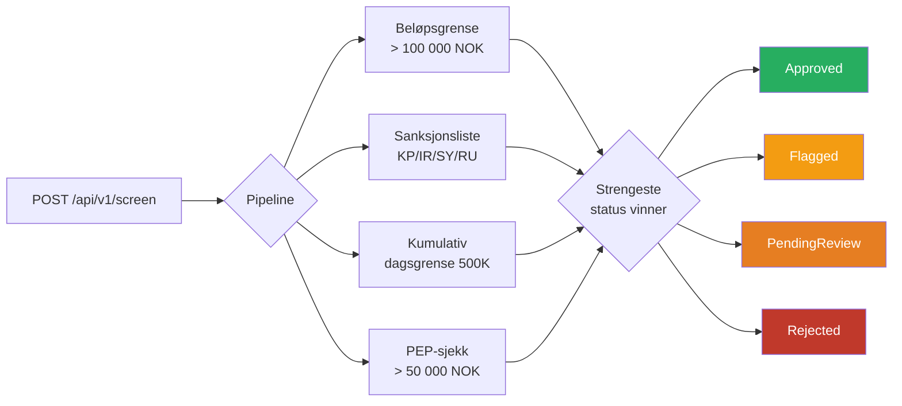
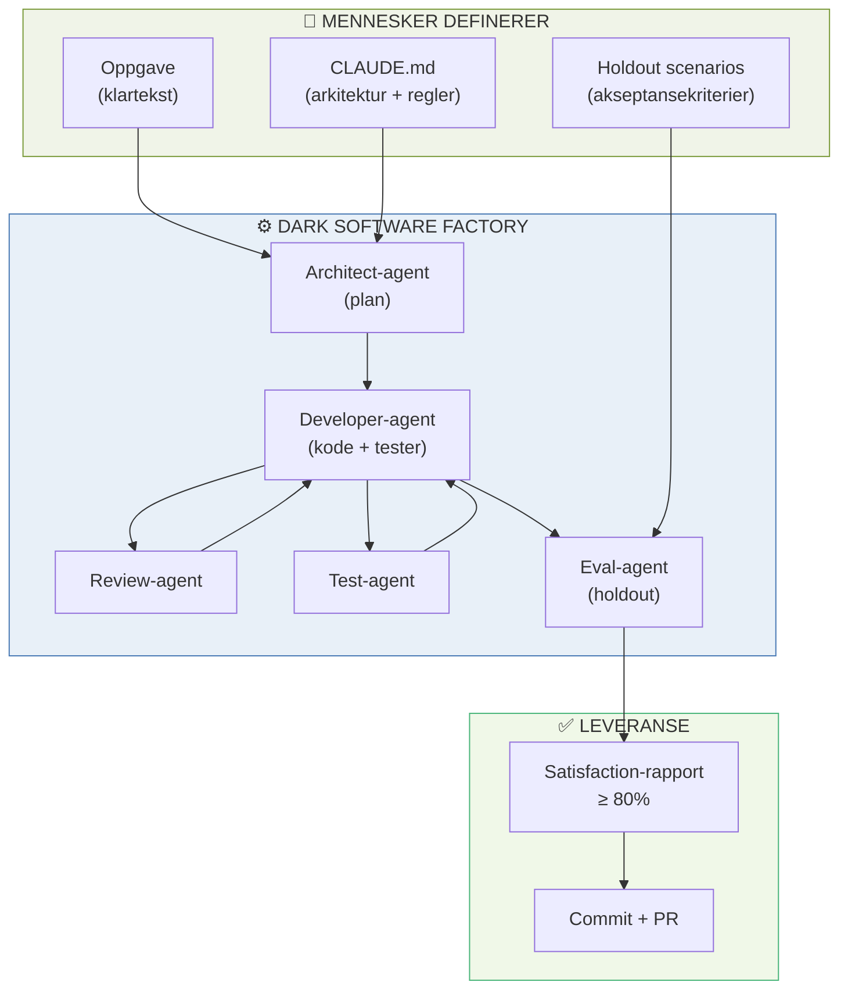
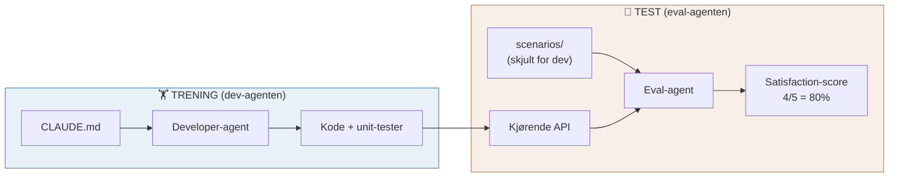
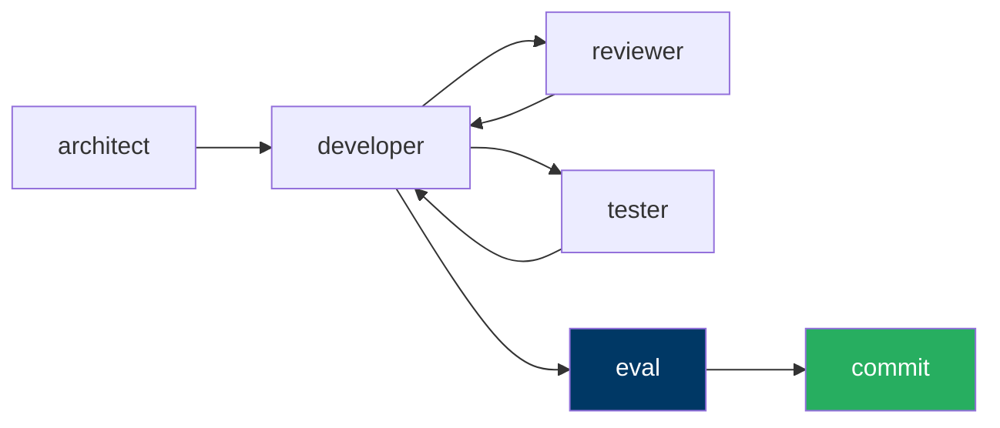
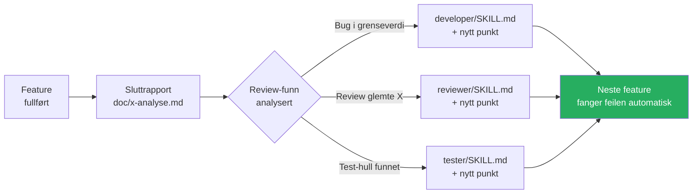
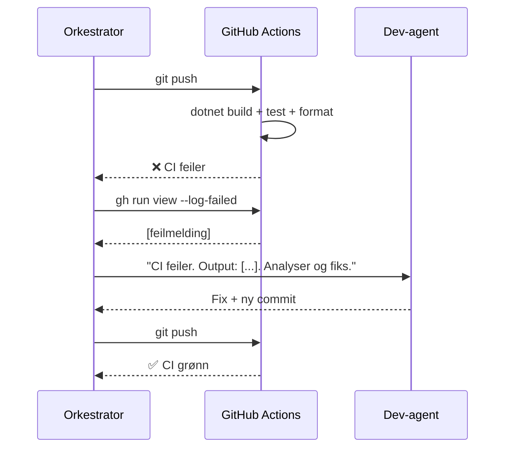

<!-- _class: lead -->

# Dark Software Factory
## Transaction Compliance Service — DNB Liv

**AI-agenter som bygger, tester og leverer produksjonsklar kode**

---

# Dette er ikke science fiction

<br>

| Selskap | Status |
|---------|--------|
| **StrongDM** | Ingen menneskeskrevet kode siden juli 2025 |
| **Spotify** | 650 AI-genererte pull requests per måned |
| **Stripe** | 1 300+ AI-PRs per uke |

<br>

> **Nøkkelpoeng for DNB Liv:** De fleste team er på nivå 2.
> Det mest verdifulle steget akkurat nå er **2→3**.

---

# Fra autocomplete til autonom fabrikk



| Nivå | Menneskelig rolle | |
|------|------------------|-|
| 1 — Autocomplete | Utvikler driver alt | |
| 2 — Chat-koding | Utvikler reviewer og styrer | |
| 3 — Agentisk | Utvikler godkjenner resultat | |
| **4 — Spekk-drevet** | **Produkteier, ikke programmerer** | **← dette repoet** |
| **5 — Dark Factory** | **Definerer intensjon og kvalitet** | **← dette repoet** |

**Allerede nivå 5:** ingen linje-for-linje review — bare `doc/*-analyse.md` og satisfaction-score · hooks blokkerer avvik uten menneskelig intervensjon · eval-agenten ser aldri kildekoden

**Mangler for full nivå 5:** ingen produksjonskode kjørt ennå · 80%-terskel ikke empirisk kalibrert · nye scenarier genereres ikke automatisk fra domenemodellen

---

# Hva vi bygger i dag

**Transaction Compliance Service** — .NET 8/C# REST API som screener transaksjoner:



Typisk DNB Liv-oppgave: **regelbasert, krever presisjon, DORA-sporbarhet**

---

# Dark Software Factory — arkitekturen



---

# Menneske vs. AI — ansvarsdeling

**Mennesker skriver én gang (stabilt):**

| Fil | Hva |
|-----|-----|
| `CLAUDE.md` | Arkitektur, regler, API-kontrakt — *hva* som er riktig |
| `scenarios/` | Holdout-fasit — kan AI-genereres fra `CLAUDE.md`, men dev-agenten ser dem **aldri** |
| `.claude/skills/*.md` | Rolledefinisjon per agent |
| `.claude/hooks/` | Kvalitetsporter som blokkerer avvik |

**Per iterasjon — menneskelig input:** *én setning*

```
Ny compliance-regel: PEP-sjekk. Mottaker PEP + beløp > 50 000 NOK → pending_review.
```

**Aldri menneskelig ansvar:** `src/`, `tests/`, `.github/workflows/`, `doc/*-plan.md`, `doc/*-analyse.md`

> Hvis et menneske skriver disse, er fabrikken ikke mørk.

---

# Nøkkelprinsipp: Train/Test-separasjon



> StrongDM oppdaget at agenter som **kan se testene** skriver kode som gamer dem
> — inkludert `return true`. Løsningen: fasiten holdes adskilt fra implementøren.

**Samme prinsipp som train/test-split i maskinlæring.**

---

# Satisfaction-metrikk — ikke binær pass/fail

**Gammelt:** Alle tester grønne ✅ / røde ❌

**Nytt:**

```
Satisfaction: 4/5 scenarier tilfredsstilt (80%)

✅ 01-amount-threshold     → Flagged       (forventet: Flagged)
✅ 02-sanctioned-country   → Rejected      (forventet: Rejected)
✅ 03-normal-payment       → Approved      (forventet: Approved)
❌ 04-cumulative-daily-limit → Approved    (forventet: Flagged)
✅ 05-pep-check            → PendingReview (forventet: PendingReview)
```

- **≥ 80%:** Pipeline fortsetter til commit
- **< 80%:** Dev-agenten fikser → ny eval-runde

<br>

> Tester skrevet av dev-agenten er "in-distribution".
> Holdout-scenarier er "out-of-distribution" — **de tester om kravene faktisk er oppfylt**.

---

# Repostruktur

```
dnb-compliance-dsf/
├── CLAUDE.md                ← Kontrakten med agentene (les dette først)
├── .claudeignore            ← scenarios/ usynlig for alle dev-agenter
│
├── .claude/
│   ├── hooks/
│   │   ├── require-plan.sh      ← Blokkerer kode uten plan
│   │   ├── require-review.sh    ← Blokkerer commit uten GODKJENT
│   │   └── require-analyse.sh  ← Blokkerer commit uten sluttrapport
│   └── skills/
│       ├── architect/   developer/   reviewer/   tester/
│       └── eval/        ← NY: holdout evaluator
│
├── scenarios/           ← HOLDOUT — dev-agenten ser aldri dette
│   ├── 01-amount-threshold.md
│   ├── 02-sanctioned-country.md
│   └── ... (5 scenarier)
│
└── doc/                 ← Plan- og analysedokumenter (auto-generert)
```

---

# Skills-katalogen

| Skill | Rolle | Nøkkeloutput |
|-------|-------|-------------|
| **architect** | Tekniske valg + faset plan | `doc/[feature]-plan.md` |
| **developer** | Implementering + unit-tester | `src/` + `tests/` |
| **reviewer** | Code review + sikkerhet | GODKJENT / AVVIST |
| **tester** | Testkvalitet + smoke test | Testresultat-rapport |
| **eval** | Holdout-evaluering | Satisfaction-score (**ny**) |

<br>



---

# Selv-evolverende skills

Etter hver ferdigstilte feature:



> Samme mekanisme som Memento-Skills (ny forskning 2026):
> AI-agenter som **utvikler egne skills over tid** uten å retrene modellen.

---

# CLAUDE.md vokser — slik håndterer du det

**CLAUDE.md er indeks og protokoll, ikke domenedokumentasjon.**
Når den vokser, degraderes alle agent-interaksjoner — kontekstvinduet fylles med støy.

| Signal | Tiltak |
|--------|--------|
| > 200 linjer | Splitt |
| Detalj finnes i CLAUDE.md + skill | Flytt til skill, pek fra CLAUDE.md |
| Regeloversikt > 5 regler | `doc/domain-rules.md` |
| Nytt subsystem | `src/[modul]/CLAUDE.md` |

**Hierarkisk CLAUDE.md** — Claude Code leser alle på vei ned:

```
CLAUDE.md                    ← protokoll + etablerte beslutninger (index)
src/Core/CLAUDE.md           ← IScreeningRule-kontrakt, domeneregler
src/Api/CLAUDE.md            ← Minimal API-konvensjoner, middleware
src/Infrastructure/CLAUDE.md ← PEP-mock, CountryLists, eksterne avhengigheter
```

**Ny regel → tre filer i samme commit:**

```
doc/domain-rules.md   ← detaljert regellogikk
CLAUDE.md             ← én tabellrad + peker
scenarios/            ← nytt holdout-scenario
```

---

# CI Self-Healing



Agenten er koblet til **hele utviklingssyklusen** — ikke bare kodegenerering.

---

# Kom i gang

**Åpne Claude Code i dette repoet:**

```bash
cd dnb-compliance-dsf
claude
```

**Prompt til orkestratoren (deg):**

```
Les CLAUDE.md.
Dispatcher architect-agent for Transaction Compliance Service.
Les .claude/skills/architect/SKILL.md og lag implementeringsplan.
Lagre i doc/compliance-service-plan.md.
```

**Etter siste fase — holdout-evaluering:**

```bash
dotnet run --project src/Api
# Ny agent-sesjon:
# "Les .claude/skills/eval/SKILL.md
#  Les scenarios/-mappen
#  API kjører på http://localhost:5000
#  Lever satisfaction-rapport."
```

---

<!-- _class: dark -->

# Nøkkelpunkter

<br>

1. **Kontekst er alt** — `CLAUDE.md` er den viktigste filen. Kvaliteten på input bestemmer kvaliteten på output.

2. **Holdout scenarios er game-changer** — separasjonen mellom implementør og evaluator er det som gjør autonom koding trygg.

3. **Satisfaction > pass/fail** — probabilistisk evaluering fanger hva tester skrevet av agenten selv ikke ser.

4. **Skills selvjusterer** — feedback-loopen (analyse → skill-oppdatering) gjør fabrikken bedre for hver iterasjon.

5. **Erfaring blir mer verdifull** — den som vet hva "riktig" betyr i et forsikringssystem, **definerer kvaliteten**. Det krever domeneforståelse — nøyaktig det DNB Liv har.

---

<!-- _class: lead -->

# Spørsmål?

<br>

**Neste steg:**
1. Velg én tjeneste og én oppgavetype i DNB Liv
2. Skriv `CLAUDE.md` for den tjenesten
3. Kjør første agent-syklus

<br>

> *"Ikke hopp til nivå 5 — bygg tillit inkrementelt."*
